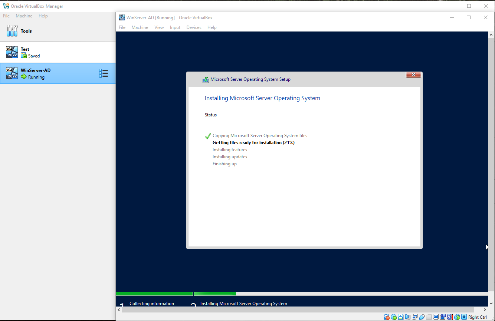
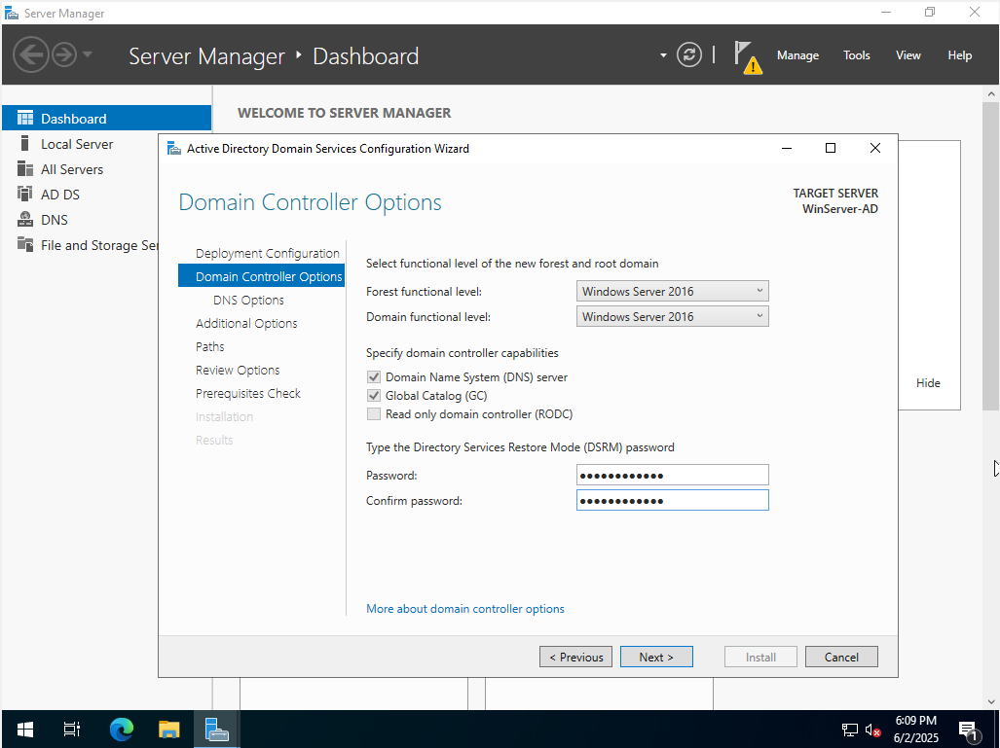

# Lab 1: Installing Windows Server 2022 with Active Directory and DNS

This lab demonstrates the process of deploying Windows Server 2022 as a domain controller with DNS support using Oracle VirtualBox.

## 🧾 Overview

- Installed Windows Server 2022 Standard (Desktop Experience) on a VirtualBox VM
- Installed and configured Active Directory Domain Services (AD DS)
- Installed and configured DNS Server
- Promoted the server to a domain controller with the domain `test.local`

## 💻 Tools Used

- Oracle VirtualBox
- Windows Server 2022 Evaluation ISO
- GUI-based installation with Server Manager

## 🖼️ Screenshots

| Step | Description                              | Screenshot |
|------|------------------------------------------|------------|
| 01   | VM creation and ISO selection            |  |
| 02   | Unattended setup: username and hostname  |  |
| 03   | VM hardware configuration                |  |
| 04   | Creating virtual hard disk               |  |
| 05   | VM setup summary                         |  |
| 06   | Windows Server installation progress     |  |
| 07   | Server Manager after installation        |  |
| 08   | Selecting AD DS and DNS roles            |  |
| 09   | Promote server to domain controller      |  |
| 10   | Create new domain `test.local`           |  |
| 11   | Set DSRM password                        |  |
| 12   | DNS delegation warning                   |  |
| 13   | NetBIOS domain name confirmation         |  |
| 14   | Prerequisites check with warnings        |  |
| 15   | Review options summary                   |  |
| 16   | AD DS and DNS installed successfully     |  |

## 🏁 Result

The VM is now acting as a domain controller and DNS server for the `test.local` domain.
